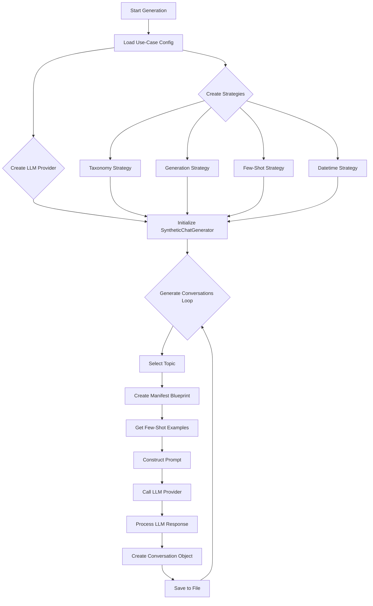

# Chat Factory Package README

This document provides a detailed overview of the `chat_factory` package, its components, and the overall architecture of the conversation generation process.

## Architecture and Workflow

The `chat_factory` package is designed with a modular, strategy-based architecture. This allows for easy extension and customization for different use cases. The core of the package is the `SyntheticChatGenerator`, which orchestrates the various components to generate synthetic conversations.

### Generation Workflow (DAG)

The following diagram illustrates the Directed Acyclic Graph (DAG) of the conversation generation process:

## Component Breakdown

### `config`

*   **Purpose:** This component is responsible for loading and managing the configuration for the application.
*   **`base_config.py`:** Defines the `BaseConfig` dataclass, which contains all the possible configuration options for the framework. This provides a single source of truth for the configuration schema.
*   **`config_loader.py`:** Contains the `load_config_from_file` function, which loads a use-case-specific Python file and populates a `BaseConfig` object with the settings defined in that file.

### `llm`

*   **Purpose:** This component provides an abstraction layer for interacting with different Large Language Models (LLMs).
*   **`base.py`:** Defines the `LLMProvider` abstract base class. This class specifies the interface that all LLM providers must implement, ensuring consistency across different providers.
*   **`mock.py`:** Implements a `MockLLMProvider` that returns predefined responses. This is crucial for local development and testing, as it allows you to run the application without needing to make actual API calls.
*   **`vertex_ai.py`:** Implements the `VertexAIProvider` for interacting with Google's Gemini models via the Vertex AI SDK. It includes logic for handling both the GenAI and Vertex AI SDKs, as well as retry logic with exponential backoff for handling API rate limits.

### `models`

*   **Purpose:** This component defines the data structures used throughout the application.
*   **`conversation.py`:** Contains the dataclasses for `ConversationFile`, `SingleConversation`, and `ChatLine`. These models define the structure of the generated data and are used for serialization and validation.
*   **`taxonomy.py`:** Defines the dataclasses for `Taxonomy`, `TaxonomyTopic`, and other related structures. These models provide a structured representation of the taxonomy files.

### `strategies`

*   **Purpose:** This is the core of the framework's modularity. The strategy pattern is used to encapsulate different algorithms and behaviors for various parts of the generation process.
*   **`base/`:** This subdirectory contains the abstract base classes for each type of strategy (`TaxonomyStrategy`, `GenerationStrategy`, `FewShotExampleStrategy`, `DatetimeStrategy`).
*   **Use-Case Specific Implementations:** The other subdirectories (`financial_advisory`, `company_tagging`, etc.) contain the concrete implementations of these strategies for each use case.
*   **`__init__.py`:** This file acts as a factory for creating strategy objects. It maintains a registry of all available strategies and provides functions for creating them based on the configuration.

### `utils`

*   **Purpose:** This component contains various helper functions and utilities that are used throughout the application.
*   **`batch_logging.py`:** Contains the `SummaryStatisticsLogger` class for logging detailed metrics about the generation process.
*   **`__init__.py`:** Contains helper functions for setting up logging, sanitizing filenames, and ensuring directories exist.