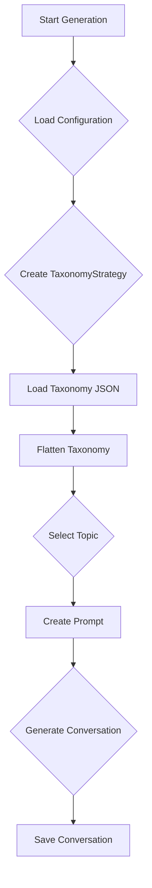

# Taxonomies README

This document provides an overview of the taxonomies used in the `chat-factory` project, how they work, and how to create new ones.

## High-Level Overview

The taxonomies are JSON files that define the structure and topics for the generated conversations. They are the primary mechanism for controlling the content and variety of the synthetic data.

### Current Taxonomies

*   **`financial_advisory.json`**: This taxonomy is designed for generating conversations between financial advisors and their clients. It includes a wide range of topics, from small talk and market commentary to detailed financial planning.

*   **`company_tagging_gemini2.json`**: This taxonomy is focused on generating conversations that involve specific companies. It is used for training and evaluating named entity recognition (NER) models. In addition to conversation topics, it includes a `conversation_types` section that provides detailed settings for how companies should be mentioned in the conversation.

## How Taxonomies Fit into the Code Generation

The taxonomies are used by the `TaxonomyStrategy` in the conversation generation process. The workflow is as follows:

1.  The `TaxonomyStrategy` loads the appropriate taxonomy file based on the use-case configuration.
2.  The taxonomy is flattened into a list of possible topics.
3.  For each conversation to be generated, the `TaxonomyStrategy` selects a random topic from the flattened list.
4.  This selected topic is then used by the `GenerationStrategy` to construct the prompt for the LLM, ensuring that the generated conversation is relevant to the chosen topic.

### Mermaid Diagram of the Workflow



## Creating and Adding Your Own Taxonomies

Creating a new taxonomy allows you to generate conversations for a completely new use case. Here's how to do it:

### 1. Create a New Taxonomy JSON File

Create a new JSON file in the `taxonomies/` directory. The structure of the JSON file will depend on your use case. You can use the existing taxonomies as a starting point.

**Simple Taxonomy (like `financial_advisory.json`):**

This is a simple key-value structure where the keys are the main categories and the values are either a list of topics or a nested object of sub-topics.

```json
{
  "Category 1": [
    "Topic 1.1",
    "Topic 1.2"
  ],
  "Category 2": {
    "Sub-Category 2.1": [
      "Topic 2.1.1",
      "Topic 2.1.2"
    ]
  }
}
```

**Advanced Taxonomy (like `company_tagging_gemini2.json`):**

This format includes a `conversation_types` section that provides more detailed control over the generation process.

```json
{
  "Category 1": [
    "Topic 1.1",
    "Topic 1.2"
  ],
  "conversation_types": {
    "Your Conversation Type": {
      "description": "A brief description of the conversation type.",
      "message_format": "formal",
      "company_tagging": {
        "enabled": true,
        "company_count_options": [1, 2, 3],
        "probability": 0.8
      }
    }
  }
}
```

### 2. Update the Configuration

Once you have created your new taxonomy file, you need to create a new configuration file in the `configs/` directory to use it.

1.  **Copy an existing configuration file:** Copy an existing configuration file (e.g., `configs/financial_advisory_gemini2.py`) and rename it for your new use case (e.g., `configs/my_new_use_case.py`).

2.  **Update the `TAXONOMY_FILE` setting:** In your new configuration file, update the `TAXONOMY_FILE` setting to point to your new taxonomy file.

    ```python
    TAXONOMY_FILE = "taxonomies/my_new_taxonomy.json"
    ```

### 3. Create New Strategies (Optional)

If your new taxonomy has a unique structure or requires special handling, you may need to create new strategies.

1.  **Create a new `TaxonomyStrategy`:** If your taxonomy has a different structure from the existing ones, you will need to create a new `TaxonomyStrategy` in the `chat_factory/strategies/` directory that knows how to parse it.

2.  **Create a new `GenerationStrategy`:** If you need to customize the prompt construction or response processing for your new use case, you will need to create a new `GenerationStrategy`.

3.  **Register your new strategies:** In `chat_factory/strategies/__init__.py`, you will need to import and register your new strategies so that they can be used by the framework.

### 4. Create a New Runner Script

Finally, create a new runner script in the root directory (e.g., `run_my_new_use_case.py`) that loads your new configuration file. You can copy an existing runner script and modify it to load your new config.
